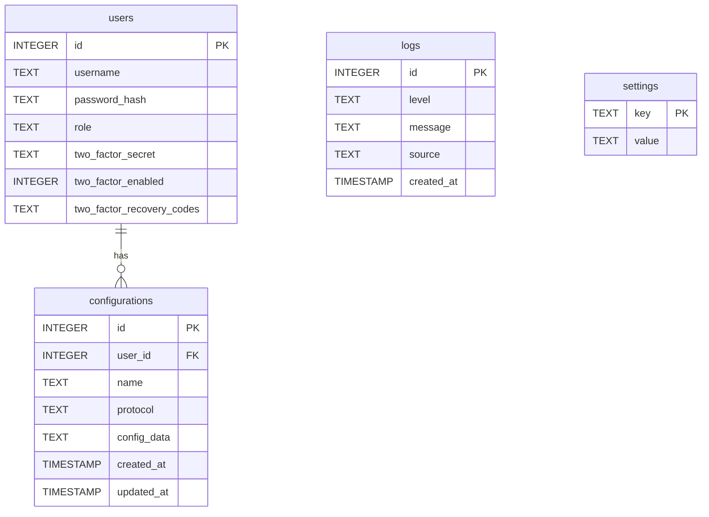

# K2Ray Database Documentation

This document provides a comprehensive overview of the K2Ray application's database, including its schema, ER diagram, and operational guidelines.

## 1. Entity-Relationship (ER) Diagram

The following diagram illustrates the relationships between the tables in the database.



## 2. Schema Documentation

### `users` Table

Stores user account information.

| Column                      | Type    | Constraints       | Description                                                 |
| --------------------------- | ------- | ----------------- | ----------------------------------------------------------- |
| `id`                        | INTEGER | PRIMARY KEY       | The unique identifier for the user.                         |
| `username`                  | TEXT    | NOT NULL, UNIQUE  | The user's login name.                                      |
| `password_hash`             | TEXT    | NOT NULL          | The hashed password for the user.                           |
| `role`                      | TEXT    | NOT NULL          | The role of the user (e.g., 'admin', 'user').               |
| `two_factor_secret`         | TEXT    | NULLABLE          | The secret key for TOTP-based two-factor authentication.    |
| `two_factor_enabled`        | INTEGER | NOT NULL, DEFAULT 0 | A flag indicating if 2FA is enabled (0 for false, 1 for true). |
| `two_factor_recovery_codes` | TEXT    | NULLABLE          | A JSON array of single-use codes for 2FA recovery.          |

**Indexes:**
- `PRIMARY KEY` on `id`.
- `UNIQUE` constraint on `username`.

### `configurations` Table

Stores V2Ray configurations created by users.

| Column       | Type      | Constraints   | Description                                                                 |
| ------------ | --------- | ------------- | --------------------------------------------------------------------------- |
| `id`         | INTEGER   | PRIMARY KEY   | The unique identifier for the configuration.                                |
| `user_id`    | INTEGER   | NOT NULL, FK  | A reference to the `id` in the `users` table, linking the config to a user. |
| `name`       | TEXT      | NOT NULL      | A user-defined name for the configuration.                                  |
| `protocol`   | TEXT      | NOT NULL      | The V2Ray protocol used (e.g., 'vmess', 'vless').                           |
| `config_data`| TEXT      | NOT NULL      | The full V2Ray configuration, stored as a JSON string.                      |
| `created_at` | TIMESTAMP | NOT NULL      | The timestamp when the configuration was created.                           |
| `updated_at` | TIMESTAMP | NOT NULL      | The timestamp when the configuration was last updated.                      |

**Indexes:**
- `PRIMARY KEY` on `id`.
- `idx_configurations_user_id` on `user_id` for faster lookups of a user's configurations.

### `logs` Table

Stores application and system-level logs.

| Column     | Type      | Constraints | Description                                         |
| ---------- | --------- | ----------- | --------------------------------------------------- |
| `id`       | INTEGER   | PRIMARY KEY | The unique identifier for the log entry.            |
| `level`    | TEXT      | NOT NULL    | The severity of the log (e.g., 'INFO', 'WARN', 'ERROR'). |
| `message`  | TEXT      | NOT NULL    | The log message content.                            |
| `source`   | TEXT      | NULLABLE    | The origin of the log entry (e.g., 'API', 'System').|
| `created_at`| TIMESTAMP | NOT NULL    | The timestamp when the log entry was created.       |

**Indexes:**
- `PRIMARY KEY` on `id`.
- `idx_logs_created_at` on `created_at` for efficient time-based log filtering.
- `idx_logs_level` on `level` for filtering logs by severity.

### `settings` Table

A key-value store for application-wide settings.

| Column  | Type | Constraints | Description                                |
| ------- | ---- | ----------- | ------------------------------------------ |
| `key`   | TEXT | PRIMARY KEY | The unique key for the setting.            |
| `value` | TEXT | NOT NULL    | The value associated with the key.         |

**Indexes:**
- `PRIMARY KEY` on `key`.

## 3. Database Utilities

### Migrations

The project uses `go-migrate` for managing database schema changes. Migration files are located in `internal/db/migrations/`.

- **Structure:** Each migration consists of an `up` and a `down` file.
  - `*.up.sql`: Contains the SQL to apply the migration.
  - `*.down.sql`: Contains the SQL to revert the migration.
- **Creating a New Migration:** To add a new migration, create two new files with sequential numbering (e.g., `000005_my_feature.up.sql` and `000005_my_feature.down.sql`) in the migrations directory. The application will automatically apply new migrations on startup.

### Backup and Restore

Backup and restore operations are handled by shell scripts in the `scripts/` directory.

- **Backup:** To create a backup of the database:
  ```bash
  ./scripts/backup.sh
  ```
  This script creates a timestamped copy of the `k2ray.db` file in the `backups/` directory.

- **Restore:** To restore the database from a backup:
  ```bash
  ./scripts/restore.sh <path_to_backup_file>
  ```
  **Warning:** This will overwrite the current database. You will be prompted for confirmation before the operation proceeds.

### Data Seeding

Data seeding is the process of populating the database with initial data. In this project, seeding is handled through the migration system. This approach ensures that seed data is applied consistently across all environments.

For example, the `000005_seed_initial_settings.up.sql` migration populates the `settings` table with default application values.

## 4. Query Optimization Guide

To ensure the database remains performant, follow these guidelines:

- **Use Indexes:** Write queries that leverage the existing indexes. Filter by `user_id` on the `configurations` table and use `created_at` or `level` in `WHERE` clauses for the `logs` table.
- **Avoid `SELECT *`:** Select only the columns you need to reduce data transfer and memory usage.
- **Limit Results:** Use `LIMIT` and `OFFSET` for pagination when retrieving large sets of data.
- **Analyze Queries:** For complex queries, use `EXPLAIN QUERY PLAN` in SQLite to understand how the query is executed and whether it's using the appropriate indexes.
  ```sql
  EXPLAIN QUERY PLAN SELECT * FROM logs WHERE level = 'ERROR' ORDER BY created_at DESC;
  ```