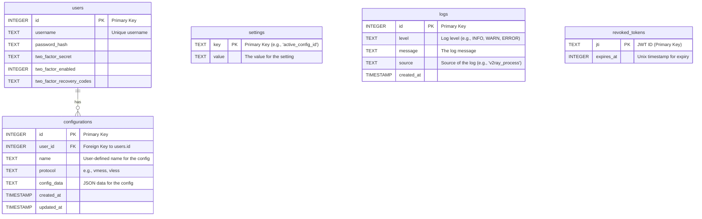

# Database Documentation

This document provides a comprehensive overview of the K2Ray application's database, including its schema, migration system, and management utilities.

## 1. Overview

- **Database Engine:** SQLite 3
- **Migration Framework:** [golang-migrate/migrate](https://github.com/golang-migrate/migrate)

The database is a single SQLite file (`k2ray.db` by default) located in the project root. All schema and data changes are managed through versioned SQL migration files located in `internal/db/migrations/`.

## 2. Entity-Relationship (ER) Diagram

The following diagram illustrates the relationships between the tables in the database.



## 3. Schema Details

### `users` Table
Stores user account information.

| Column                      | Type      | Constraints      | Description                               |
| --------------------------- | --------- | ---------------- | ----------------------------------------- |
| `id`                        | `INTEGER` | `PRIMARY KEY`    | Auto-incrementing unique user ID.         |
| `username`                  | `TEXT`    | `NOT NULL UNIQUE`| User's login name.                        |
| `password_hash`             | `TEXT`    | `NOT NULL`       | Bcrypt hash of the user's password.       |
| `two_factor_secret`         | `TEXT`    | `NULL`           | Encrypted secret for 2FA.                 |
| `two_factor_enabled`        | `INTEGER` | `NOT NULL`       | `1` if 2FA is enabled, `0` otherwise.     |
| `two_factor_recovery_codes` | `TEXT`    | `NULL`           | JSON array of single-use recovery codes.  |

### `configurations` Table
Stores V2Ray server configurations created by users.

| Column       | Type        | Constraints                    | Description                                  |
| ------------ | ----------- | ------------------------------ | -------------------------------------------- |
| `id`         | `INTEGER`   | `PRIMARY KEY`                  | Auto-incrementing unique configuration ID.   |
| `user_id`    | `INTEGER`   | `NOT NULL, FOREIGN KEY(users)` | The user who owns this configuration.        |
| `name`       | `TEXT`      | `NOT NULL`                     | A friendly name for the configuration.       |
| `protocol`   | `TEXT`      | `NOT NULL`                     | The V2Ray protocol (e.g., `vmess`, `vless`). |
| `config_data`| `TEXT`      | `NOT NULL`                     | The full configuration details as a JSON string. |
| `created_at` | `TIMESTAMP` | `NOT NULL`                     | Timestamp of creation.                       |
| `updated_at` | `TIMESTAMP` | `NOT NULL`                     | Timestamp of the last update.                |

### `settings` Table
A key-value store for system-wide settings.

| Column  | Type | Constraints   | Description                                           |
| ------- | ---- | ------------- | ----------------------------------------------------- |
| `key`   | `TEXT` | `PRIMARY KEY` | The unique key for the setting (e.g., `active_config_id`). |
| `value` | `TEXT` | `NOT NULL`    | The value associated with the key.                    |

### `logs` Table
Stores application and system-level log entries.

| Column     | Type        | Constraints   | Description                               |
| ---------- | ----------- | ------------- | ----------------------------------------- |
| `id`       | `INTEGER`   | `PRIMARY KEY` | Auto-incrementing unique log ID.          |
| `level`    | `TEXT`      | `NOT NULL`    | Log level (e.g., `INFO`, `ERROR`).        |
| `message`  | `TEXT`      | `NOT NULL`    | The log message content.                  |
| `source`   | `TEXT`      | `NULL`        | The part of the system the log came from. |
| `created_at`| `TIMESTAMP`| `NOT NULL`    | Timestamp when the log was recorded.      |

### `revoked_tokens` Table
Stores JWTs that have been revoked (e.g., via logout) before their natural expiry.

| Column       | Type      | Constraints   | Description                                    |
| ------------ | --------- | ------------- | ---------------------------------------------- |
| `jti`        | `TEXT`    | `PRIMARY KEY` | The unique identifier (JWT ID) of the token.   |
| `expires_at` | `INTEGER` | `NOT NULL`    | Unix timestamp when the token can be purged.   |

## 4. Migration Management

The `golang-migrate/migrate` CLI is used to create and manage database migrations.

### Creating a New Migration
To create a new migration, run the following command from the project root. Replace `your_migration_name` with a descriptive name.

```bash
# You may need to install the CLI first:
# go install -tags 'sqlite3' github.com/golang-migrate/migrate/v4/cmd/migrate@latest

migrate create -ext sql -dir internal/db/migrations -seq your_migration_name
```
This will create `up` and `down` migration files. Edit the `.up.sql` file to apply your changes and the `.down.sql` file to revert them.

### Applying Migrations
Migrations are applied automatically when the application starts.

## 5. Backup and Restore

Simple shell scripts are provided in the `scripts/` directory for database management.

### Creating a Backup
The `backup.sh` script creates a timestamped copy of the database file in the `backups/` directory.

```bash
./scripts/backup.sh
```

### Restoring from a Backup
The `restore.sh` script overwrites the current database with a specified backup file.

**Warning:** This is a destructive operation.

```bash
# Usage: ./scripts/restore.sh <path_to_backup_file>
./scripts/restore.sh backups/k2ray-backup-YYYYMMDD-HHMMSS.db
```

## 6. Query Optimization Guide

SQLite is generally fast for its intended use case, but performance can degrade with very large datasets or complex queries. Here are some basic tips:

1.  **Use Indexes:** The most critical performance optimization. Indexes have been added to foreign keys (`user_id`) and frequently queried columns (`revoked_tokens.expires_at`, `users.username`). Add new indexes if you find certain `WHERE` clauses are slow.
2.  **Use `EXPLAIN QUERY PLAN`:** To understand how SQLite is executing your query, prefix it with `EXPLAIN QUERY PLAN`. This will show you if indexes are being used.
    ```sql
    EXPLAIN QUERY PLAN SELECT * FROM configurations WHERE user_id = 123;
    ```
3.  **Wrap Transactions:** For multiple `INSERT`, `UPDATE`, or `DELETE` operations, wrap them in a transaction (`BEGIN; ... COMMIT;`) to significantly speed them up.
4.  **Avoid `SELECT *`:** Only select the columns you actually need. This reduces the amount of data read from the disk and sent over the wire.
5.  **PRAGMA Tuning:** SQLite has several `PRAGMA` commands that can tune its behavior. For example, `PRAGMA journal_mode=WAL;` can improve concurrency. These are advanced and should be used with care.